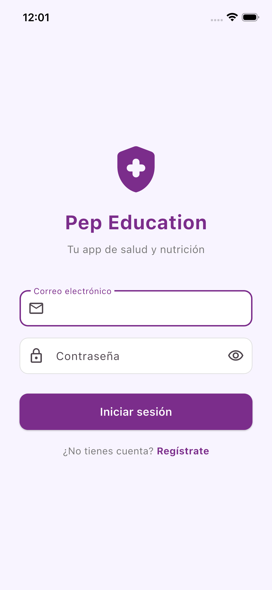

# Pep Education — App Flutter (iOS + Android)

## Descripción General

Versión Flutter de la app móvil de Pep Education. Reescritura completa desde React Native/Expo a Flutter/Dart para eliminar dependencias de Metro bundler y obtener compilación nativa directa.

| Parámetro | Valor |
|-----------|-------|
| Framework | Flutter 3.41.6 |
| Lenguaje | Dart 3.x (null safety) |
| Ubicación | `/Users/marco/Proyectos/Pep/mobile_flutter/` |
| Bundle ID iOS | `com.pepeducation.pepEducation` |
| Package Android | `com.pepeducation.pep_education` |
| Supabase | `mpdpbfaorquuqvhawwea` (producción) |

---

## Estructura del Proyecto

```
mobile_flutter/
├── lib/
│   ├── main.dart                        # Entry point, Supabase init, AuthGate
│   ├── constants/
│   │   └── theme.dart                   # Colores y tema Material 3
│   ├── services/
│   │   └── supabase_service.dart        # Todas las llamadas a Supabase
│   ├── widgets/
│   │   └── main_shell.dart              # Bottom nav + onboarding check
│   └── screens/
│       ├── auth/
│       │   ├── login_screen.dart        # Login email/password
│       │   └── register_screen.dart     # Registro nuevo usuario
│       ├── onboarding/
│       │   └── onboarding_screen.dart   # Nombre, altura, peso actual, meta
│       └── tabs/
│           ├── home_screen.dart         # Bienvenida, BMI, próxima cita
│           ├── weight_screen.dart       # CRUD pesajes + fotos
│           ├── progress_screen.dart     # Gráfica fl_chart
│           ├── reminders_screen.dart    # Calendario + CRUD citas nativas
│           └── support_screen.dart      # Botón WhatsApp
├── ios/                                 # Proyecto Xcode (abre .xcworkspace)
├── android/                             # Proyecto Android Gradle
└── pubspec.yaml                         # Dependencias
```

---

## Dependencias Principales

```yaml
supabase_flutter: ^2.9.0      # Auth + DB + Storage
fl_chart: ^0.69.0             # Gráfica de peso
image_picker: ^1.1.2          # Seleccionar fotos
table_calendar: ^3.2.0        # Widget calendario
device_calendar: ^4.4.0       # Sincronizar con calendario nativo
intl: ^0.20.2                 # Fechas en español
shared_preferences: ^2.5.3    # Persistencia local
url_launcher: ^6.4.1          # Abrir WhatsApp
```

---

## Pantallas de la App

### 1. Login

- Email y contraseña
- Botón "Iniciar sesión"
- Link a Registro
- Colores: fondo `#F8F4FF`, botón `#7B2D8B`

### 2. Registro
- Nombre completo, email, contraseña
- Validación de campos
- Redirige a Onboarding al crear cuenta

### 3. Onboarding
- Paso único: nombre, altura (cm), peso actual (kg), peso meta (kg)
- Solo se muestra la primera vez
- Guarda en tabla `profiles`

### 4. Inicio (Home)
- Saludo personalizado con nombre del paciente
- Tarjeta BMI con índice calculado y categoría
- Próximo recordatorio/cita
- Stats: último peso y días de seguimiento

### 5. Peso (Weight)
- Botón FAB amarillo para agregar registro
- Lista de pesajes con fecha, peso y miniatura de foto
- Toca un registro para ver/editar/borrar
- Modal de agregar: peso (kg/lb), fecha, notas, foto de galería o cámara
- Subida de fotos a Supabase Storage bucket `patient-photos`

### 6. Progreso (Progress)
- Gráfica de línea (`fl_chart`) de peso vs tiempo
- Línea punteada: peso meta
- Filtros: 1 mes, 3 meses, 6 meses, 1 año
- Lista de historial con tendencia (↑↓)

### 7. Recordatorios (Reminders)
- Calendario mensual (`table_calendar`) con puntos en días con citas
- Sección "Próximos recordatorios" o "Recordatorios del día X"
- FAB para agregar: título, fecha, hora, notas
- Editar y borrar con confirmación
- **Sincronización con calendario nativo** del dispositivo (calendario "Pep Education")
- Al crear: añade al calendario del iPhone/Android con alarma 1h antes
- Al borrar: también borra del calendario nativo

### 8. Soporte (Support)
- Botón de contacto por WhatsApp

---

## Cómo Probar en Simulador iOS

### Requisitos
- Mac con Xcode instalado
- Flutter instalado: `brew install --cask flutter`

### Pasos

```bash
# 1. Ir a la carpeta Flutter
cd /Users/marco/Proyectos/Pep/mobile_flutter

# 2. Instalar dependencias
flutter pub get

# 3. Ver simuladores disponibles
flutter devices

# 4. Correr en el simulador iPhone 16e (o el que esté booteado)
flutter run -d "D1884CD1-9BB7-4063-AE60-ACF9AC62CF80"
```

Una vez corriendo, en la terminal:
- `r` → Hot reload (recarga cambios de UI instantáneo)
- `R` → Hot restart (reinicia la app)
- `q` → Salir

### Abrir en Xcode (solo para compilar/firmar)
```bash
open ios/Runner.xcworkspace
```
> ⚠️ Siempre abrir `.xcworkspace`, nunca `.xcodeproj`

---

## Cómo Generar APK Android

```bash
cd /Users/marco/Proyectos/Pep/mobile_flutter
flutter build apk --release
# APK en: build/app/outputs/flutter-apk/app-release.apk
```

---

## Cómo Generar IPA iOS (requiere Apple Developer $99/año)

```bash
cd /Users/marco/Proyectos/Pep/mobile_flutter
flutter build ios --release
# Luego abrir Xcode → Product → Archive → Distribute App
```

---

## Variables de Entorno / Configuración

Las credenciales de Supabase están hardcodeadas en `lib/main.dart` (igual que la versión React Native). Para producción, mover a un archivo `.env` con `flutter_dotenv`.

```dart
// lib/main.dart
await Supabase.initialize(
  url: 'https://mpdpbfaorquuqvhawwea.supabase.co',
  anonKey: '...',
);
```

---

## Diferencias vs Versión React Native

| Aspecto | React Native / Expo | Flutter |
|---------|---------------------|---------|
| Bundler | Metro (requiere servidor activo) | Sin bundler — compila directo |
| Inicio simulador | `npx expo run:ios` + Metro separado | `flutter run` (todo en uno) |
| Hot reload | Sí (más lento) | Sí (más rápido) |
| Fotos Android | Problema con `content://` URIs | Sin problema |
| iOS simulator | Timeouts frecuentes | Funciona directo |
| Build iOS | EAS cloud o local Xcode | `flutter build ios` local |
| Build Android | `./gradlew assembleRelease` | `flutter build apk` |
| Tamaño APK | ~87 MB | ~20-30 MB (estimado) |

---

## Agentes Utilizados

Para crear esta versión Flutter se utilizó:

1. **general-purpose agent** — Creó todos los archivos Dart (`main.dart`, screens, services, widgets, `pubspec.yaml`), corrió `flutter pub get`, `flutter analyze` y `flutter build ios --simulator`. Verificó que compilara sin errores.

---

## Estado Actual

| Feature | Estado |
|---------|--------|
| Auth (login/register) | ✅ Funcional |
| Onboarding | ✅ Funcional |
| Home con BMI | ✅ Funcional |
| CRUD Peso + fotos | ✅ Funcional |
| Gráfica progreso | ✅ Funcional |
| Recordatorios + calendario | ✅ Funcional |
| Sync calendario nativo | ✅ Funcional |
| Soporte WhatsApp | ✅ Funcional (actualizar número) |
| iOS Simulator | ✅ Funciona con `flutter run` |
| Android APK | ✅ `flutter build apk --release` |
| App Store (iOS) | ⏳ Requiere Apple Developer ($99/año) |
| Google Play (Android) | ⏳ Requiere cuenta Play Console ($25) |

---

## Pendientes

1. Actualizar número de WhatsApp en `lib/screens/tabs/support_screen.dart`
   ```dart
   static const String _whatsAppNumber = '52XXXXXXXXXX'; // ← cambiar
   ```
2. Permisos iOS en `ios/Runner/Info.plist` (auto-generados por `flutter pub get` para `image_picker` y `device_calendar`)
3. Si se usa TestFlight: crear App ID y certificado en Apple Developer
